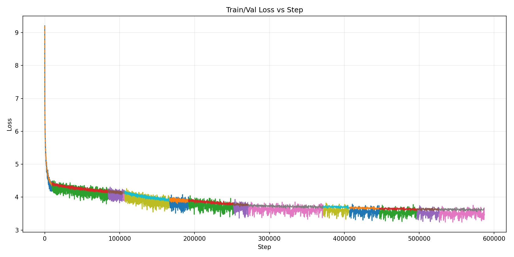
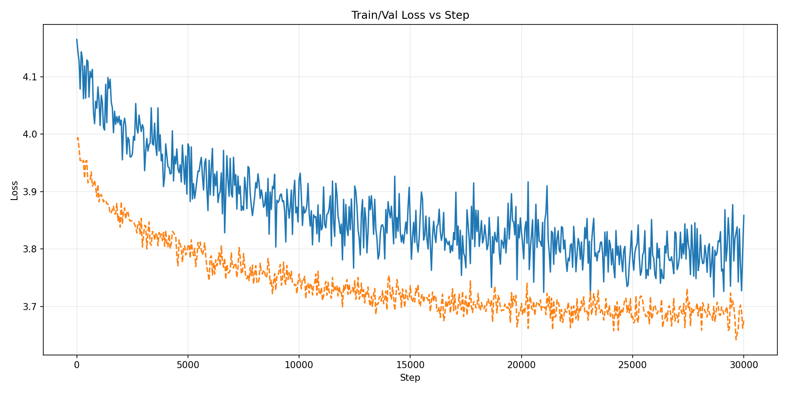

# Andrić-LLM: A Transformer-based Language Model

This project is dedicated to building and training a transformer-based language model on the literary works of the Nobel prize-winning author, Ivo Andrić, and other Serbian texts. The model can be trained from scratch or fine-tuned from a pre-trained model to generate text that mimics the style and vocabulary of Andrić's writing.

## Features

- **Transformer Model:** A custom implementation of a transformer model for text generation.
- **SentencePiece Tokenization:** Utilizes SentencePiece for subword tokenization, which is effective for morphologically rich languages like Serbian.
- **Training and Generation:** Scripts for both training the model on a given text corpus and generating new text from a trained model.
- **Highly Customizable:** Training parameters like embedding dimension, number of layers, heads, and dropout are easily configurable.
- **Mixed Precision Training:** Support for gradient accumulation to simulate larger batch sizes.
- **Fine-tuning:** Capability to initialize training from a pre-trained model.

## Directory Structure

```
.
├── books/            # Scripts for processing book texts
├── input/            # Raw text files for training
├── models/           # Saved model checkpoints
├── nlp/              # Python virtual environment
├── output/           # Training logs and outputs
├── src/              # Source code for the model, training, etc.
│   ├── cli.py        # Command-line interface
│   ├── config.py     # Training configuration
│   ├── data.py       # Data loading and processing
│   ├── generate.py   # Text generation script
│   ├── model.py      # Transformer model definition
│   ├── train.py      # Training script
│   └── ...
├── tokenizer/        # SentencePiece tokenizer models
└── andric.py         # Main script to run training or generation
```

## Getting Started

### Prerequisites

- Python 3.x
- A virtual environment (recommended)

### Installation

1.  **Clone the repository:**
    ```bash
    git clone https://github.com/urosDeljanin/andricLLM
    cd andricLLM
    ```

2.  **Set up the Python environment:**
    It is recommended to use a virtual environment.

    ```bash
    python -m venv venv
    source venv/bin/activate
    pip install -r requirements.txt
    ```

## Usage

The main entry point for the project is `andric.py`, which provides a command-line interface for training and text generation.

### Training

To train the model, use the `train` mode. You can specify various parameters to customize the training process.

```bash
python andric.py --mode train \
    --input-path input/sveKnjige.txt \
    --save-path models/andric_transformer.pt \
    --block-size 512 \
    --batch-size 20 \
    --embed-dim 384 \
    --num-layers 6 \
    --num-heads 6 \
    --lr 3e-4 \
    --max-steps 3000
```

**Key Training Arguments:**

-   `--input-path`: Path to the training text file (default: `input/sveKnjige.txt`).
-   `--save-path`: Path to save the trained model (default: `models/andric_model.pt`).
-   `--init-from`: Initialize training from a pre-trained model (default: `None`).
-   `--block-size`: Context size for the transformer (default: `512`).
-   `--batch-size`: Number of sequences per batch (default: `20`).
-   `--embed-dim`: Dimension of the token embeddings (default: `384`).
-   `--num-layers`: Number of transformer layers (default: `6`).
-   `--num-heads`: Number of attention heads (default: `6`).
-   `--lr`: Learning rate (default: `3e-4`).
-   `--max-steps`: Total number of training steps (default: `3000`).

### Text Generation

To generate text from a trained model, use the `generate` mode.

```bash
python andric.py --mode generate \
    --init-from models/andric_model.pt \
    --prompt "У кафани је седео" \
    --max-new-tokens 500 \
    --temperature 0.7 \
    --top-k 30
```

**Key Generation Arguments:**

-   `--init-from`: Path to the trained model (default: `None`).
-   `--prompt`: The initial text prompt to start generation from (default: `""`).
-   `--max-new-tokens`: The maximum number of new tokens to generate (default: `500`).
-   `--temperature`: Controls the randomness of the output. Lower values make the output more deterministic (default: `0.7`).
-   `--top-k`: Restricts the vocabulary to the `k` most likely next tokens (default: `30`).

## Model

The model is a decoder-only transformer, similar in architecture to GPT. It uses multi-head self-attention, feed-forward neural networks, and layer normalization. The vocabulary is built using SentencePiece from the training corpus.

## Data

The model is designed to be trained on plain text files. The `input/` directory contains the training data, which should be a single large text file. The scripts in the `books/` directory can be used to preprocess and format raw text from different sources into a suitable format for training.

## Pre-trained Models and Training Details

### Serbian Base Model (`sr_model.pt`)
The base Serbian model was trained on a large corpus of approximately **2.8 billion tokens** consisting of general Serbian language text collected from the internet (exclusively in Cyrillic). The training was conducted in multiple stages, incorporating hyperparameter tuning to optimize the model's performance over time.



### Andrić Model (`andric_model.pt`)
This model was trained specifically on the collected and carefully cleaned literary works of Ivo Andrić. By learning from these texts, the model adapted to mimic Andrić's unique writing style, tone, and vocabulary.



## Contributing

Contributions are welcome! Please feel free to submit a pull request or open an issue if you have any suggestions or find any bugs.